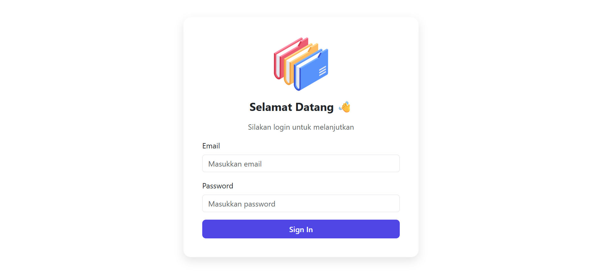
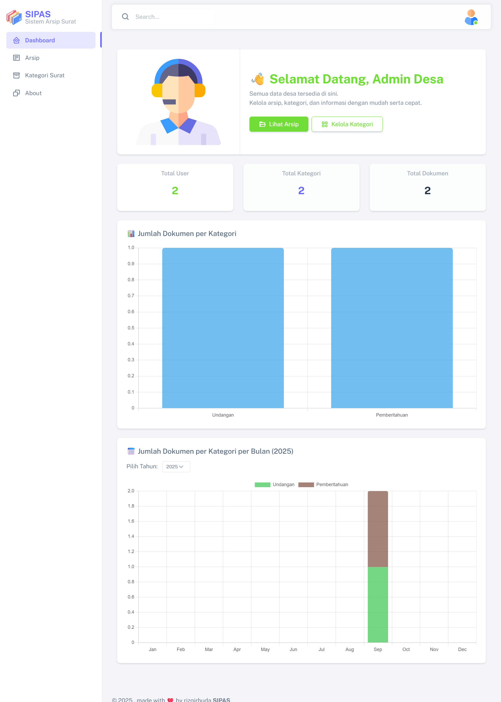
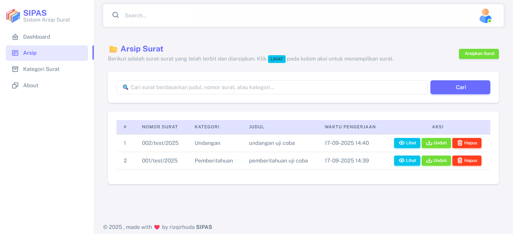
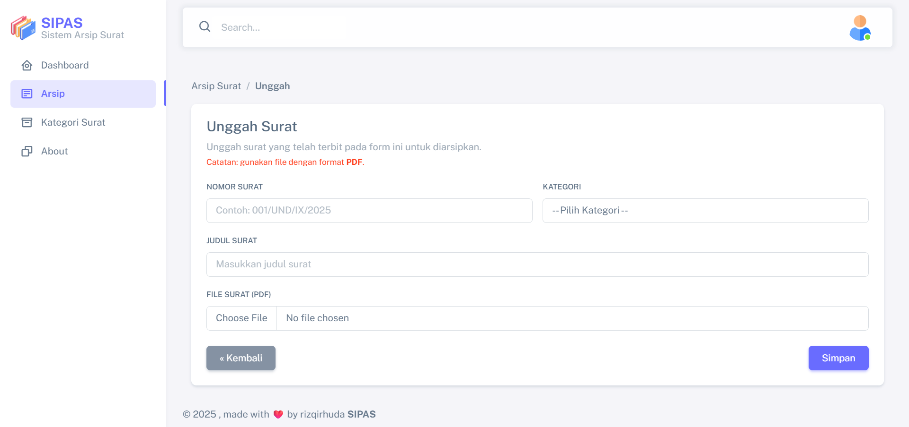
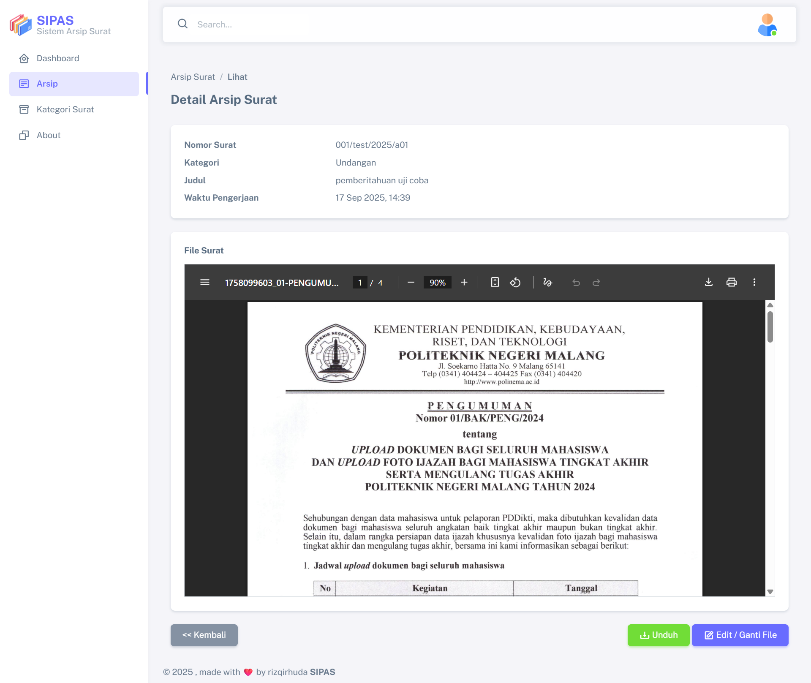
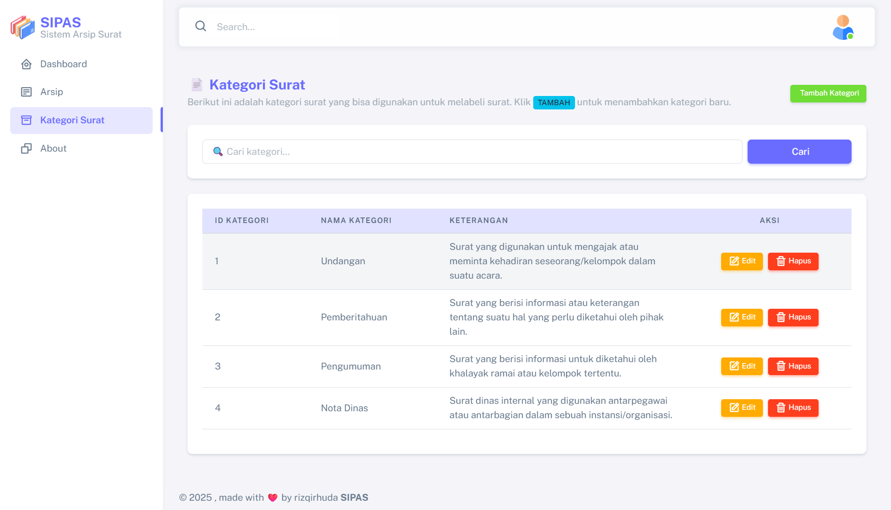
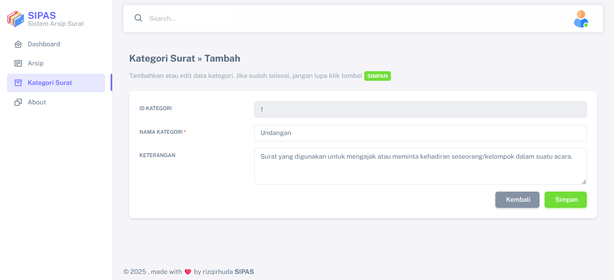
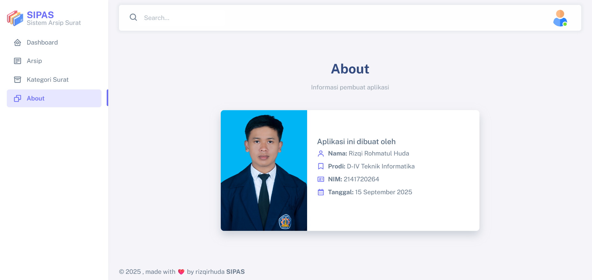

# 📄 Sistem Informasi Pengarsipan Surat [SIPAS]

Sistem Informasi Pengarsipan  Surat adalah aplikasi berbasis web untuk **mengelola dokumen dan surat** secara digital.  
Dikembangkan menggunakan **Laravel + Boostrap**, sistem ini memudahkan pengguna dalam menyimpan, mengelompokkan, mencari, dan mengunduh dokumen dengan cepat.

---

## 📌 Tujuan  

- Menyediakan platform digital untuk penyimpanan arsip surat agar lebih rapi dan terstruktur.  
- Memudahkan pengguna dalam melakukan pencarian dokumen dengan cepat berdasarkan kategori maupun kata kunci.  
- Mengurangi penggunaan arsip fisik sehingga mendukung efisiensi ruang penyimpanan.  
- Meningkatkan keamanan data dengan sistem yang terkelola secara terpusat.  
- Memberikan kemudahan akses dokumen kapan saja dan di mana saja melalui perangkat berbasis web.  

---

## ⚡ Fitur

-   🔐 **Autentikasi & Role User**

    -   Login & Logout
    -   Role-based Access Control (Admin, User)

-   📊 **Dashboard**

    -   Statistik jumlah user, kategori, dokumen
    -   Grafik Jumlah Dokumen per Kategori (Bar Chart)
    -   Grafik Jumlah Dokumen pert Kategori per Bulan dynamic year (Stacked Bar Chart)

- 📄 **Manajemen Kategori Surat**
    -   Tambah, Edit, Hapus
    -   Pencarian Kategori
    -   Tampilan data kategori dalam table 

- 📁 **Manajemen Arsip Surat**
    - Tambah arsip dokumen dan upload file pdf
    - Tampilan data arsip dokumen dalam tabel
    - Detail menampilkan detail arsip surat
    - Edit dokumen surat, Unduh file
    - Hapus arsip dokumen
    - Pencarian dokumen berdasarkan judul, kategori, atau nomor dokumen


-   👤 **Halaman Tentang (About)**
    -   Informasi pembuat aplikasi
    -   Foto profil 

---

## ⚙️ Requirement

-   PHP >= 8.2
-   Composer
-   MySQL 8 / MariaDB
-   Git

## Tampilan

---

-   **Halaman Login**  
    
-   **Dashboard**  
    
-   **Manajemen Arsip Dokumen**  
    
    
    
-   **Manajeme Kategori Surat**  
    
    
-   **About**  
    

## Teknologi yang Digunakan

-   **Backend**: Laravel
-   **Frontend**: Boostrap
-   **Authentication-Setup**: Laravel Authentication
-   **Database**: MySQL
-   **Role Management**: Middleware
-   **CSS Framework**: Boostrap CSS
-   **Icon**: boxicons

## Instalasi

Ikuti langkah-langkah berikut untuk menjalankan proyek ini di lingkungan lokal Anda:

### Prasyarat
Sebelum memulai, pastikan Anda sudah menginstal:  
- [PHP >= 8.2](https://www.php.net/downloads)  
- [Composer](https://getcomposer.org/)  
- [MySQL >= 8](https://dev.mysql.com/downloads/)  
- [Node.js & NPM](https://nodejs.org/)  
- [Git](https://git-scm.com/)  
- Web server (contoh: [Laragon](https://laragon.org/), XAMPP, atau Valet)  


### Langkah Instalasi

1. Clone repositori ini:

    ```bash
    git clone https://github.com/RizqiRHuda/sipas.git
    cd repository-name
    ```

2. Instal dependensi PHP:

    ```bash
    composer install
    ```

3. Salin file `.env.example` menjadi `.env`:

    ```bash
    cp .env.example .env
    ```

4. Atur konfigurasi database di file `.env`:

    ```env
    DB_CONNECTION=mysql
    DB_HOST=127.0.0.1
    DB_PORT=3306
    DB_DATABASE=nama_database
    DB_USERNAME=username
    DB_PASSWORD=password
    ```

5. Generate application key:

    ```bash
    php artisan key:generate
    ```

6. Jalankan migrasi database:

    ```bash
    php artisan migrate
    ```

7. Jalankan seeder (opsional, jika ada data awal):

    ```bash
    php artisan db:seed
    ```

8. Jalankan server pengembangan:

    ```bash
    composer run dev
    ```

Aplikasi sekarang dapat diakses di `http://localhost:8000`.

---

### Kontak

Jika Anda memiliki pertanyaan, silakan hubungi:

Email: rizqirhuda45@gmail.com
